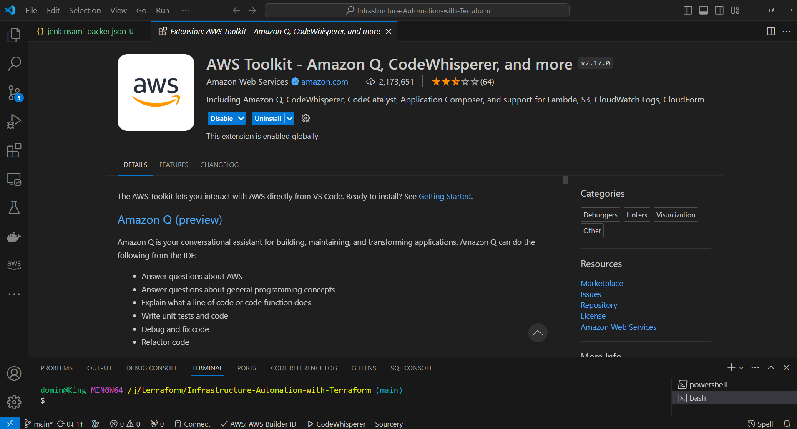

# Generative-AI & AWS

AWS offers a range of generative AI solutions designed to help businesses innovate faster and boost productivity. Here are some of the key offerings:

| AWS Generative Solutions | Description |
|--------------------------|-------------|
| **Amazon Bedrock** | A platform for building and scaling generative AI applications, offering access to foundation models like Anthropic's Claude 3 Haiku. |
| **Generative AI Application Builder** | Facilitates rapid development and deployment of generative AI applications, integrating with Amazon Bedrock and LLMs on Amazon SageMaker. |
| **AWS Inferentia2 Chips** | Used in Amazon EC2 Inf2 instances to reduce the cost of running generative AI workloads. |
| **AWS Trainium Chips** | Custom silicon designed for faster model training, available in Trn1n instances. |
| **Amazon CodeWhisperer** | Provides real-time coding assistance, now free for individual developers. |

These solutions incorporate security, privacy, and responsible AI practices, leveraging AWS's efficient and cost-effective infrastructure. For more information, visit the AWS Generative AI page.

## Amazon CodeWhisperer

AWS CodeWhisperer offers several advantages to enhance developer productivity and code quality:

| Benefit | Description |
|---------|-------------|
| **Increased Efficiency** | Generates code suggestions from snippets to full functions in real-time, based on comments and existing code. |
| **Expert Assistance** | Amazon Q, an interactive AI-powered assistant, provides expert guidance through a conversational interface within the IDE. |
| **Enhanced Security** | Identifies security vulnerabilities and offers code suggestions to remediate issues, ensuring code is secure by design. |
| **Multi-Language Support** | Works with 15 programming languages and various IDEs, fitting seamlessly into developers' workflows. |
| **Optimized for AWS** | Provides code suggestions optimized for AWS services, adhering to AWS best practices. |
| **Customizable Suggestions** | Can be customized to understand internal libraries, APIs, packages, classes, and methods, making recommendations more relevant. |
| **Developer Productivity** | In a productivity challenge, developers using CodeWhisperer completed tasks 27% more successfully and 57% faster on average. |

### Configure AWS CodeWhisperer in Visual Studio Code

To set up AWS CodeWhisperer in Visual Studio Code, follow these steps:

1. **Launch Visual Studio Code**.
   - Open Visual Studio Code on your machine.

2. **Install the AWS Toolkit**.
   - Go to the Extensions marketplace in Visual Studio Code.
   - Search for and install the **AWS Toolkit for Visual Studio Code**.

3. **Open the AWS Toolkit**.
   - Access the AWS Toolkit from the Visual Studio Code sidebar.

4. **Authenticate with AWS**.
   - Use your AWS credentials to authenticate.
   - This can be done through AWS IAM credentials or AWS Builder ID.

5. **Enable CodeWhisperer**.
   - Find CodeWhisperer settings within the AWS Toolkit preferences.
   - Ensure that CodeWhisperer is enabled.

For more detailed instructions, consult the official AWS documentation or the AWS Toolkit for Visual Studio Code user guide.

### Using AWS CodeWhisperer in Visual Studio Code

- **Write or Open a Code File**: Create a new file or open an existing project in a supported language.
- **Start Typing Code**: Begin coding as you normally would. CodeWhisperer should offer suggestions in real-time.
- **Accept Suggestions**: When you see a suggestion that fits your needs, use `Tab` or `Enter` to accept it.
- **Trigger Suggestions Manually**: If you want to invoke CodeWhisperer manually, you can use the shortcut `Ctrl + Space` (or `Cmd + Space` on macOS) to trigger suggestions.
- **Review Suggestions**: Evaluate the relevance and accuracy of the suggestions to your coding context.
- **Check for Updates**: Ensure that the language server, which powers CodeWhisperer’s suggestions, is up-to-date. The AWS Toolkit should handle this automatically.

