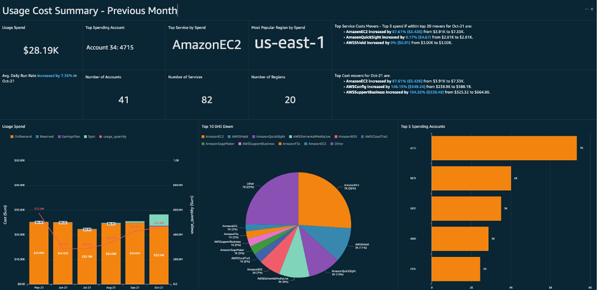

# AWS Billing and Cost Management

AWS Billing and Cost Management is a comprehensive service provided by Amazon Web Services (AWS) that encompasses a suite of features to help you understand, manage, and optimize your costs. It includes tools for setting up billing, retrieving and paying invoices, analyzing and organizing costs, and planning and budgeting to match your organization’s needs. Here’s a breakdown of its key features:

| AWS Billing and Cost Management Feature | Description |
|-----------------------------------------|-------------|
| **Billing and Payments** | Manage billing preferences, view and pay invoices, and handle tax and payment information. |
| **Cost Analysis** | Analyze costs, export cost and usage data, and forecast spending. |
| **Cost Organization** | Organize costs using cost categories or cost allocation tags. |
| **Budgeting and Planning** | Create and manage budgets and savings plans for spending control. |
| **Savings and Commitments** | Manage reserved instances and savings plans to optimize costs. |

## Categorized overview of the AWS services

| Category | Service | Description |
|----------|---------|-------------|
| Cost Visualization and Management | AWS Cost Explorer | A tool for visualizing and managing AWS costs over time, with custom reports and forecasting capabilities. |
| Cost Visualization and Management | AWS Cost and Usage Reports | Provides detailed reports for tracking AWS costs and usage, with options for hourly, daily, or monthly granularity. |
| Budgeting and Cost Control | AWS Budgets | Enables setting custom budgets for tracking costs and usage, with alerts for budget overruns. |
| Budgeting and Cost Control | AWS Cost Anomaly Detection | Utilizes machine learning to detect unusual spend and helps identify the root causes of spend anomalies. |

## AWS Billing Dashboard Overview

The AWS Billing Dashboard provides a comprehensive view of your AWS cloud financial management data. It's designed to help you understand your costs and usage, identify trends, and make informed decisions about your AWS spending. Here's a breakdown of its key components:

Reference : <https://d2908q01vomqb2.cloudfront.net/2e01e17467891f7c933dbaa00e1459d23db3fe4f/2021/12/02/CID_4.png>

| Component          | Description | Additional Information |
|--------------------|-------------|------------------------|
| **Cost Summary**   | This widget gives you a quick overview of your current cost trends compared to the previous month. It includes metrics like month-to-date cost and last month's cost for the same time period. | You can add further details here, such as specific cost metrics or comparisons. |
| **Cost Monitor**   | It helps you quickly identify any anomalies or budget overruns that require attention. | Details about the monitoring tools or specific examples of anomalies could go here. |
| **Cost Breakdown** | This section allows you to see a detailed breakdown of your costs by service, account, or region. | You might want to include information on the most significant cost drivers or tips for managing costs. |
| **Recommended Actions** | Based on your usage patterns, AWS provides recommendations for cost optimization. | Here, you could list some common recommendations or strategies for cost savings. |
| **Savings Opportunities** | This widget suggests ways to reduce costs, such as purchasing Reserved Instances or Savings Plans. | Additional details on how these savings opportunities work or how to apply them could be useful. |
| **Customization**  | You can customize the dashboard by moving or resizing widgets to fit your preferences. The Billing Dashboard is a powerful tool to manage your AWS spending effectively. | Perhaps add notes on dashboard customization options or user preferences. |

The dashboard also includes tools like AWS Cost Explorer for more detailed analysis and AWS Budgets to set custom cost and usage budgets. It's important to note that the data on the Billing Dashboard is tailored for analytical purposes and may differ from your invoices due to differences in data grouping, timing, and rounding.

## AWS Cost Management Console Capabilities

- **Overview**: The console home page offers tailored insights and recommendations, helping you make informed decisions about your cloud finances.

- **Billing and Payments**: Understand your monthly charges, manage invoices, and set preferences for billing, tax, and payments.

- **Cost Analysis**: Use AWS Cost Explorer to analyze your costs with visuals, filtering, and grouping. You can also forecast your spending and create custom reports.

- **Cost Organization**: Organize your costs across teams, applications, or environments using cost categories or allocation tags.

- **Budgeting and Planning**: Set up AWS Budgets for cost control and plan your spending according to your financial strategies.

- **Savings and Commitments**: Explore opportunities to save costs, such as purchasing Reserved Instances or Savings Plans.

- **Cost Anomaly Detection**: Set up alerts for unexpected cost anomalies to manage your budget effectively.

- **Cloud Financial Management Guide**: Learn best practices and strategies for cloud financial management to optimize your AWS spending.

The console is designed to seamlessly transition from insights to action, with clear calls to action and links to the appropriate tools for managing your AWS cloud finances. It's a comprehensive tool for gaining visibility into your spending trends, prioritizing actions to manage costs, and implementing best practices for cloud financial management.

## Best practices

1. **Understand AWS Billing**: Familiarize yourself with the AWS Cost Management tools to effectively track and manage your costs.

2. **Set Budgets**: Use AWS Budgets to set custom budgets that alert you when costs or usage exceed your predefined thresholds.

3. **Control Access**: Ensure that only authorized users have access to billing information and the ability to create budgets and alarms.

4. **Use Tags for Allocation**: Implement cost allocation tags to organize your costs by teams, projects, or environments.

5. **Optimize Costs**: Regularly review and analyze your costs with AWS Cost Explorer to identify opportunities for savings.

6. **Monitor Free Tier Usage**: Keep an eye on your AWS Free Tier usage to avoid unexpected charges.

7. **Implement Anomaly Detection**: Set up AWS Cost Anomaly Detection to get alerted about unusual spending patterns.

8. **Utilize Reserved Instances**: Purchase Reserved Instances to save on long-term usage for predictable workloads.

9. **Manage IAM Policies**: Use IAM policies to control the actions that users and services can perform on AWS resources.

10. **Automate Cost Optimization**: Consider automating cost optimization strategies using AWS Lambda and other automation tools.

## Setting up budget Alerts

Setting up budget alerts in AWS is a straightforward process that can help you manage your costs effectively. Here's a step-by-step guide to help you configure budget alerts:

1. **Navigate to AWS Budgets**: Go to the AWS Management Console and open the **Billing and Cost Management** dashboard. Then, select **Budgets** from the left pane.

2. **Create a Budget**: Click on **Create a Budget**. Choose a budget type, such as cost or usage, and define the budget amount.

3. **Set Alert Threshold**: Under **Set alert threshold**, enter the amount or percentage that needs to be reached for you to be notified.

4. **Configure Alerts**: If creating a new budget, choose **Add an alert threshold**. For an existing budget, you can edit it to add or modify alerts.

5. **Define Actions**: You can configure actions to run either automatically or after your manual approval when a budget exceeds your set threshold. Actions can include applying an IAM policy or a service control policy (SCP), or targeting specific EC2 or RDS instances.

6. **Set Up a Role**: To use budget actions, create a service role for AWS Budgets that grants the necessary permissions for AWS Budgets to perform actions on your behalf.

7. **Review and Approve**: Review your budget and alert configurations, and approve them to activate the alerts.

8. **Monitor Alerts**: Once set up, you will receive notifications via email or Amazon SNS topics when your budget thresholds are exceeded or forecasted to be exceeded.

Remember to regularly review your budgets and alerts to ensure they align with your changing needs and usage patterns.

## AWS Cloud Financial Management and ROI

1. **Cloud Value Framework**: AWS provides a framework to help customers understand the business value beyond just cost savings. This includes improvements in staff productivity, operational resilience, and business agility.

2. **Cost Optimization**: AWS encourages practices such as selecting the right pricing model, using Reserved Instances, and rightsizing your resources to improve efficiency and reduce costs.

3. **Financial Operations (FinOps)**: This involves a DevOps-like approach to financial management, focusing on the financial implications of cloud operations to make informed decisions that enhance savings and ROI.

4. **ROI Boost**: Moving to AWS can significantly lower total cost of ownership (TCO) and increase ROI. Customers often experience benefits like faster deployment of new features, reduced operational costs, and increased revenue.

5. **Financial Prudence**: It's crucial to adopt governance and cost optimization strategies to prevent runaway costs and maximize ROI. This includes implementing policies for financial accountability and efficiency.
