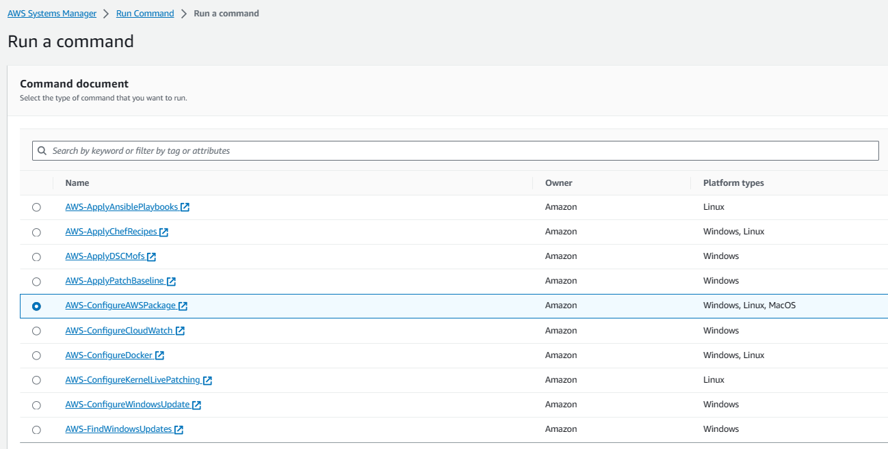
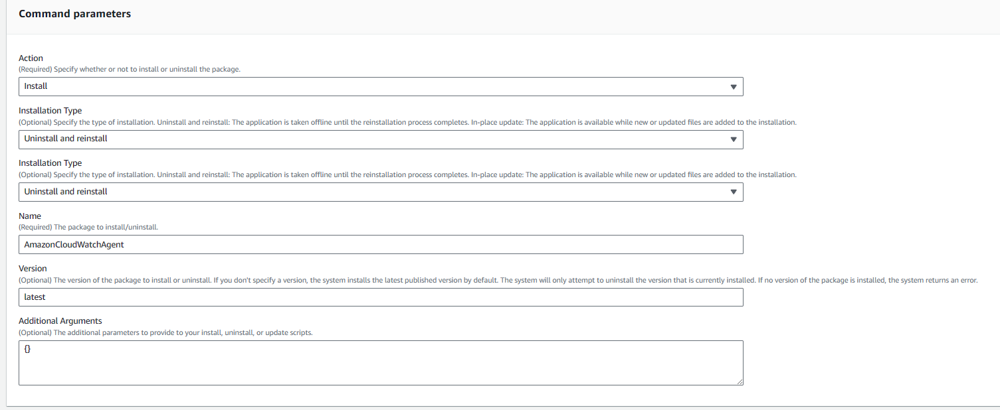
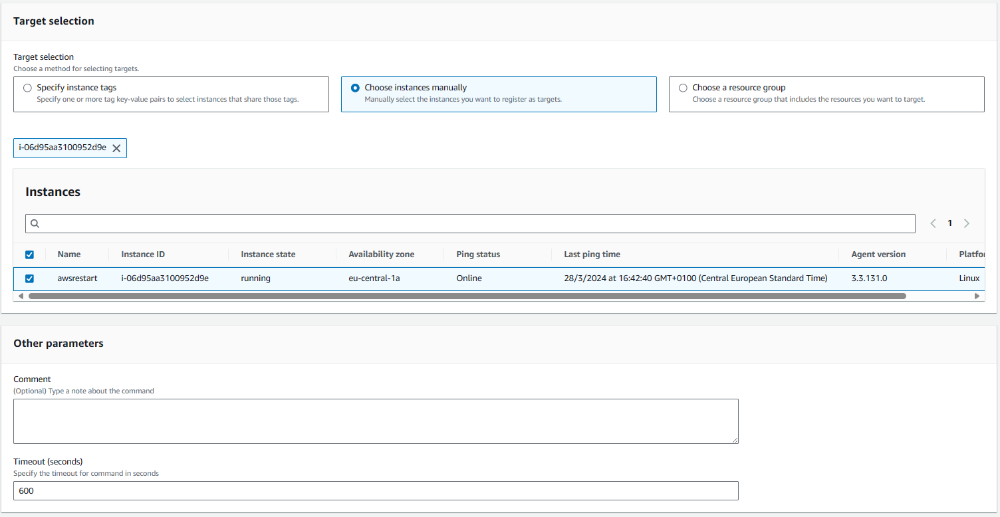
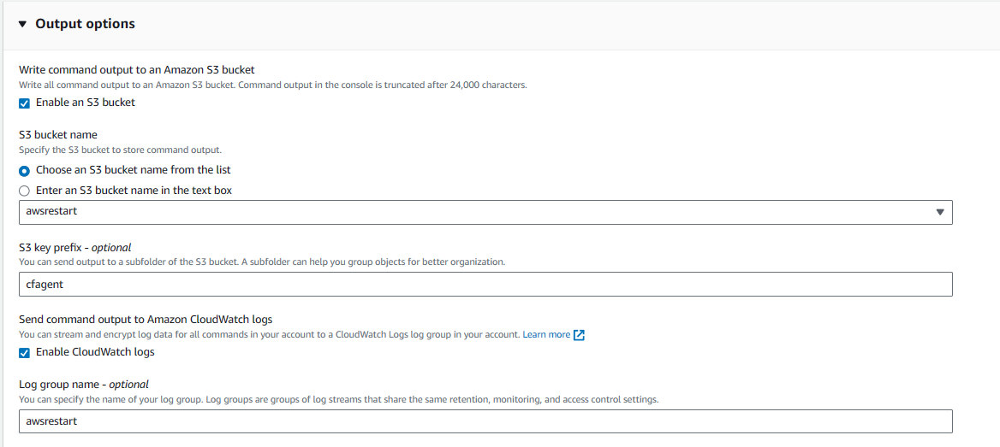
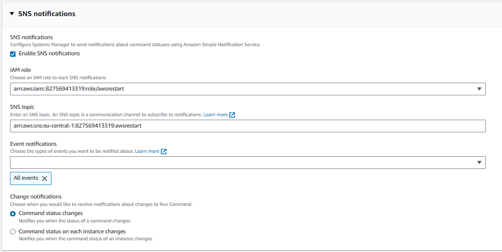
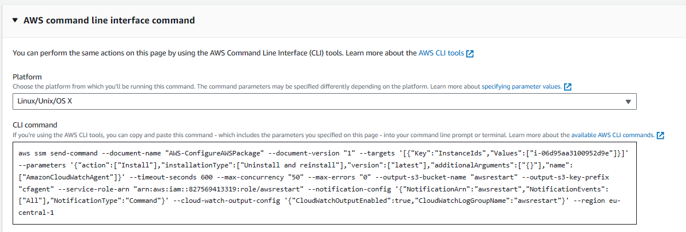
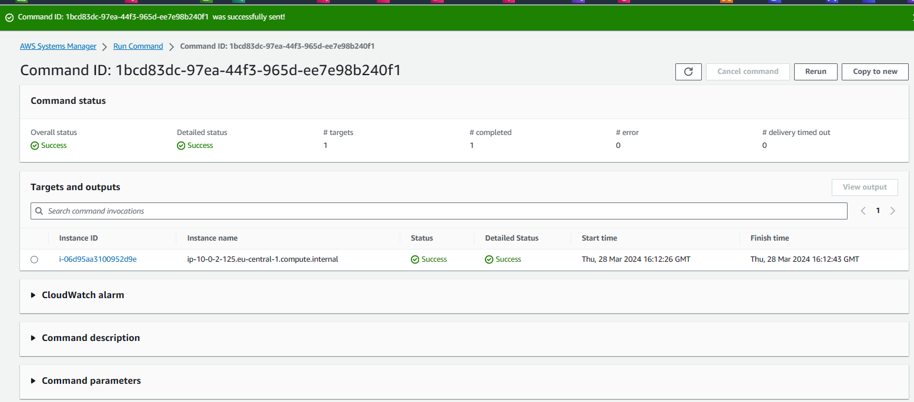
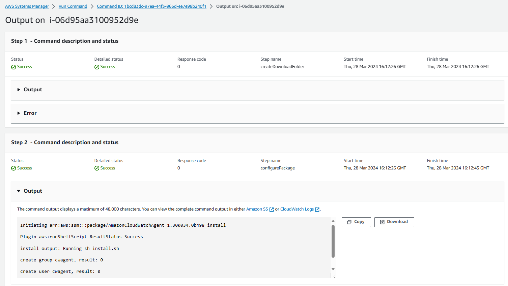

# AWS CloudWatch

AWS CloudWatch is a monitoring and observability service designed for DevOps engineers, developers, site reliability engineers (SREs), and IT managers. It provides data and actionable insights to monitor applications, respond to system-wide performance changes, optimize resource utilization, and get a unified view of operational health.

## Features

- **Real-time Monitoring**: CloudWatch collects monitoring and operational data in the form of logs, metrics, and events, providing you with a unified view of AWS resources, applications, and services that run on AWS and on-premises servers.

- **Alarms**: You can use CloudWatch to set alarms and automate actions based on predefined thresholds or machine learning algorithms that identify anomalous behavior in your environments.

- **Dashboards**: Customizable home pages in the CloudWatch console that you can use to monitor your resources in a single view, even those spread across different regions.

- **Logs**: CloudWatch Logs can be used to monitor, store, and access your log files from Amazon EC2 instances, AWS CloudTrail, and other sources.

- **Events**: CloudWatch Events delivers a near real-time stream of system events that describe changes in AWS resources.

- **Metrics**: CloudWatch provides metrics for your AWS resources and applications, allowing you to view and analyze key statistics.

For more detailed information and documentation, you can visit the [AWS CloudWatch Documentation](https://docs.aws.amazon.com/cloudwatch/).

## Cloudwatch Agent

The AWS CloudWatch Agent is a customizable monitoring service for AWS resources and applications. It collects and aggregates data such as metrics and logs, which can be used for real-time monitoring and troubleshooting.

### Key Features

- **Custom Metrics**: Collect system-level metrics from on-premises servers or EC2 instances.
- **Log Management**: Efficiently collect, monitor, and analyze log data.
- **Optimized Data Collection**: Fine-tune data collection for specific use cases and environments.

### Configuration

The CloudWatch Agent configuration file is a JSON file with sections for `agent`, `metrics`, `logs`, and `traces`. Here's a brief on what each section includes:

- `agent`: Overall configuration of the agent.
- `metrics`: Specifies custom metrics for collection and publishing to CloudWatch.
- `logs`: Defines log files to publish to CloudWatch Logs.
- `traces`: Sources for traces collected and sent to AWS X-Ray.

For detailed instructions on manually creating or editing the CloudWatch agent configuration file, visit the [official documentation](https://docs.aws.amazon.com/AmazonCloudWatch/latest/monitoring/CloudWatch-Agent-Configuration-File-Details.html).

### Installation

To install and run the CloudWatch agent on your servers:

1. Attach an IAM role or IAM user to the server.
2. Download the CloudWatch agent package using an S3 download link.
3. Install the package using the command line.

For step-by-step installation guidance, refer to the [installation instructions](https://docs.aws.amazon.com/AmazonCloudWatch/latest/monitoring/install-CloudWatch-Agent-commandline-fleet.html).

### Systems Manager & Instance Configuration

Before you can use Systems Manager to install the CloudWatch agent, you must make sure that the instance is configured correctly for Systems Manager.

1. **Configure the instance for Systems Manager**: Ensure that the EC2 instance has the necessary IAM role attached and that the Systems Manager agent is installed and running.
2. **Create IAM roles and users**: Set up the appropriate IAM roles and users for use with the CloudWatch agent.
3. **Download and configure the CloudWatch agent**: Use Systems Manager to download the CloudWatch agent and configure it according to your needs.
4. **Install the CloudWatch agent**: Install the CloudWatch agent on your EC2 instance using the configuration you've set.
5. **Verify the installation**: After installation, check the metrics in the CloudWatch console to ensure that the agent is collecting data as expected.

## Download the CloudWatch Agent Package Using Systems Manager Run Command

Systems Manager Run Command enables you to manage the configuration of your instances. You specify a Systems Manager document, specify parameters, and execute the command on one or more instances. The SSM Agent on the instance processes the command and configures the instance as specified.

### To download the CloudWatch agent using Run Command

1. Open the Systems Manager console at `https://console.aws.amazon.com/systems-manager/`.
2. In the navigation pane, choose **Run Command**.
   - *Or, if the AWS Systems Manager home page opens, scroll down and choose **Explore Run Command**.*
3. Choose **Run command**.
4. In the Command document list, choose **AWS-ConfigureAWSPackage**.
5. In the Targets area, choose the instance on which to install the CloudWatch agent. If you do not see a specific instance, it might not be configured for Run Command. For more information, see *Setting Up AWS Systems Manager for Hybrid Environments* in the AWS Systems Manager User Guide.
6. In the Action list, choose **Install**.
7. In the Name box, enter `AmazonCloudWatchAgent`.
8. Keep Version set to **latest** to install the latest version of the agent.
9. Choose **Run**.
10. Optionally, in the Targets and outputs areas, select the button next to an instance name and choose **View output**. Systems Manager should show that the agent was successfully installed.

