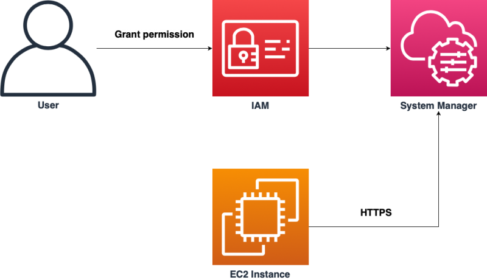

# Elastic Compute Cloud

```markdown
# Amazon EC2 (Elastic Compute Cloud)

Amazon EC2 is a central part of Amazon Web Services (AWS), providing resizable compute capacity in the cloud. It simplifies web-scale cloud computing for developers by offering virtual servers, known as instances, for running applications and workloads.
```

## Key Features of Amazon EC2

| Feature | Description |
|---------|-------------|
| **Instances** | Virtual servers with various hardware and software options for different application needs. |
| **Amazon Machine Images (AMIs)** | Templates for instances, including an OS and additional software. |
| **Instance Types** | Configurations of CPU, memory, storage, and networking capacity for different workloads. |
| **Key Pairs** | Secure login information for instances. AWS stores the public key; users store the private key. |
| **Instance Store Volumes** | Temporary storage deleted when an instance is stopped or terminated. |
| **Amazon EBS Volumes** | Persistent storage using Amazon Elastic Block Store (EBS). |
| **Regions and Availability Zones** | Physical locations of data centers around the world. Availability Zones are isolated locations within each Region. |

```markdown

EC2 provides scalable computing resources, allowing you to adjust capacity within minutes. You can launch one or thousands of server instances simultaneously and pay only for what you use.

EC2 also offers customizable security groups and networks, compliance with various programs, and the ability to process, store, and transmit credit card data.

For more detailed information, refer to the [official AWS documentation on EC2](https://aws.amazon.com/ec2/).
```

What are the different ways to connect to an Amazon EC2 instance?

**EC2 Instance Connect**: Provides a secure way of connecting to your Linux instances using SSH directly from the AWS Management Console or the EC2 Instance Connect CLI. It pushes a one-time-use SSH public key to the instance metadata for 60 seconds for enhanced security.


**Session Manager**: Part of AWS Systems Manager, it allows you to manage your EC2 instances through an interactive shell or through the AWS CLI without opening inbound ports or managing SSH keys. It provides a secure connection tunneled over a proxy connection, and the session manager agent establishes a reverse connection to the service.



**SSH client**: A traditional method of accessing remote servers, which requires network connectivity, user credentials, and often the management of SSH keys. It’s a protocol that provides a secure channel over an unsecured network in a client-server architecture.

**Remote Desktop Protocol (RDP)**: For Windows instances, you can use an RDP client to connect to your instance using its public DNS name or IP address.

**EC2 serial console**: Allows you to troubleshoot boot and network connectivity issues by providing access to the serial port of the instance. This can be particularly useful when you cannot connect to your instance using SSH1.
Each method has its own use cases and benefits, and the choice depends on the specific needs and security requirements of your AWS environment.

**Reference**:

<https://docs.aws.amazon.com/AWSEC2/latest/UserGuide/connect-to-linux-instance.html>
<https://www.ecloudture.com/en/the-methods-to-access-ec2-ssh-ec2-instance-connect-system-manager/>
