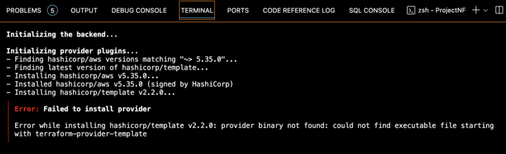
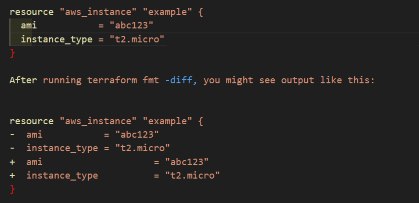
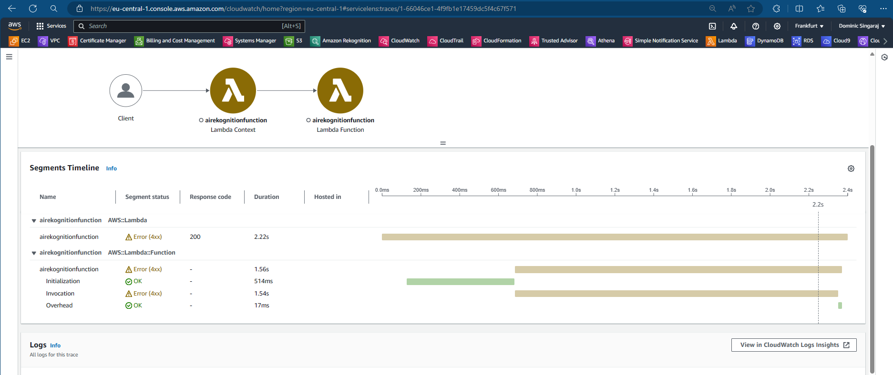

# Cloudformation

# Storage

### Comparison table highlighting the key differences between AWS S3, EFS, EBS, and Instance Store:

1 dzone.com 2 msp360.com 3 n2ws.com 4 dzone.com 5 flarecompare.com

# S3 Storage Classes

# RDS vs Dynamo DB

# Block Storage vs Object Storage 

# RDS vs Redshift 

# Amazon Machine Image

An Amazon Machine Image (AMI) is a supported and maintained image provided by AWS that provides the information required to launch an instance. You must specify an AMI when you launch an instance. You can launch multiple instances from a single AMI when you require multiple instances with the same configuration. You can use different AMIs to launch instances when you require instances with different configurations.

## An AMI includes the following:

One or more Amazon Elastic Block Store (Amazon EBS) snapshots, or, for instance-store-backed AMIs, a template for the root volume of the instance (for example, an operating system, an application server, and applications).

Launch permissions that control which AWS accounts can use the AMI to launch instances.

A block device mapping that specifies the volumes to attach to the instance when it's launched.

### Use an AMI

The following diagram summarizes the AMI lifecycle. After you create and register an AMI, you can use it to launch new instances. (You can also launch instances from an AMI if the AMI owner grants you launch permissions.) You can copy an AMI within the same AWS Region or to different AWS Regions. When you no longer require an AMI, you can deregister it.

			
https://docs.aws.amazon.com/AWSEC2/latest/UserGuide/AMIs.html

# S3 storage classes 
