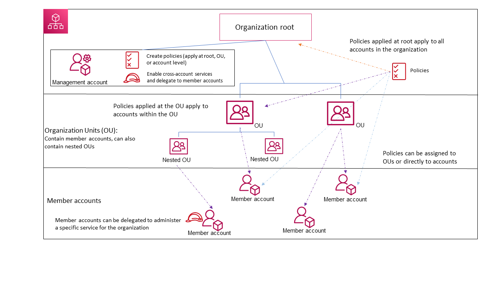
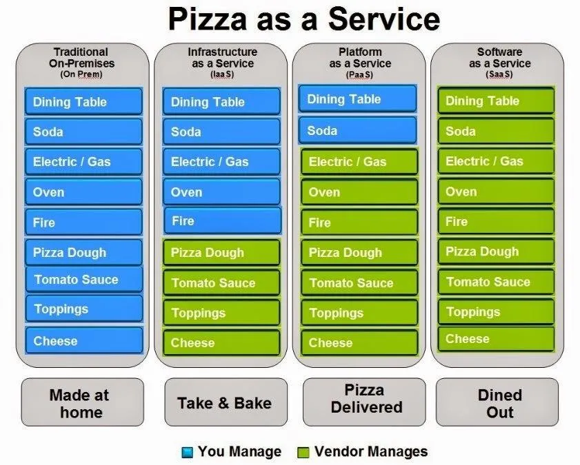

# Cloudformation

# Storage

### Comparison table highlighting the key differences between AWS S3, EFS, EBS, and Instance Store:

| Feature | AWS S3 | AWS EFS | AWS EBS | Instance Store |
|---------|--------|---------|---------|----------------|
| **Type** | Object storage | File storage | Block storage | Temporary block-level storage |
| **Use Case** | Web-based storage for large amounts of data, widely accessible | Shared file storage for use with AWS Cloud services and on-premises resources | High-performance block storage for use with EC2 and databases | Temporary storage of information that changes frequently, such as buffers, caches, scratch data, and other temporary content |
| **Data Access** | Multiple systems or users concurrently | Multiple EC2 instances concurrently | Single EC2 instance at a time | Single EC2 instance at a time |
| **Performance** | High throughput, low latency with S3 Transfer Acceleration | High throughput, low latency over NFS | High IOPS, low latency, provisioned IOPS for intensive workloads | Very high IOPS, low latency, ideal for high-speed local storage |
| **Durability** | 99.999999999% (11 9's) | 99.999999999% (11 9's) | 99.999% | Data is lost if the instance is stopped or terminated |
| **Availability** | Designed for 99.99% availability | Designed for 99.99% availability | 99.5% - 99.99% | Varies, as it is physically attached to the host computer |
| **Scalability** | Virtually unlimited storage | Automatically scales with increasing files | Fixed size, but can be increased with some effort | Fixed size, tied to the instance |
| **Pricing** | Pay for what you use, with additional cost for retrieval and requests | Pay for what you use, no additional cost for throughput or requests | Pay for provisioned storage, with additional cost for IOPS and throughput | Included in the cost of the EC2 instance |
| **Data Persistence** | Persistent | Persistent | Persistent | Non-persistent |

# S3 Storage Classes

# RDS vs Dynamo DB

# Block Storage vs Object Storage 

# RDS vs Redshift 

# Amazon Machine Image

An Amazon Machine Image (AMI) is a supported and maintained image provided by AWS that provides the information required to launch an instance. You must specify an AMI when you launch an instance. You can launch multiple instances from a single AMI when you require multiple instances with the same configuration. You can use different AMIs to launch instances when you require instances with different configurations.

## An AMI includes the following:

One or more Amazon Elastic Block Store (Amazon EBS) snapshots, or, for instance-store-backed AMIs, a template for the root volume of the instance (for example, an operating system, an application server, and applications).

Launch permissions that control which AWS accounts can use the AMI to launch instances.

A block device mapping that specifies the volumes to attach to the instance when it's launched.

### Use an AMI

The following diagram summarizes the AMI lifecycle. After you create and register an AMI, you can use it to launch new instances. (You can also launch instances from an AMI if the AMI owner grants you launch permissions.) You can copy an AMI within the same AWS Region or to different AWS Regions. When you no longer require an AMI, you can deregister it.

			
https://docs.aws.amazon.com/AWSEC2/latest/UserGuide/AMIs.html

# S3 storage classes 

# AWS Security Services

| Service | Description | Use Cases | Key Features |
|---------|-------------|-----------|--------------|
| **AWS IAM** | Manages access to AWS services and resources securely. | User and group management, access policies, multi-factor authentication. | Granular permissions, policy simulation, integration with other AWS services. |
| **Amazon Cognito** | Provides user sign-up, sign-in, and access control to web and mobile applications. | User directory management, social identity provider integration, user data synchronization. | User pools, identity pools, federation with social identity providers. |
| **AWS KMS** | Manages cryptographic keys for your applications. | Encryption key management, key rotation, key usage policies. | Hardware security modules, automated key rotation, integration with AWS services. |
| **AWS Shield** | Protects against DDoS attacks. | DDoS protection for AWS services, automatic attack mitigation, real-time visibility into attacks. | Always-on detection, inline mitigation, cost protection. |
| **Amazon Inspector** | Automated security assessment service to help improve the security and compliance of applications deployed on AWS. | Vulnerability detection, security best practices enforcement, application scanning. | Automated assessments, detailed findings, integration with AWS services. |
| **AWS WAF** | Web application firewall that helps protect web applications from common web exploits. | Rule management for web traffic filtering, real-time metrics and logging, automated web security. | Customizable web security rules, real-time visibility, rate-based rules. |
| **Amazon GuardDuty** | Threat detection service that continuously monitors for malicious activity and unauthorized behavior. | Anomaly detection, threat prioritization, integrated threat intelligence. | Machine learning, anomaly detection, integrated threat intelligence feeds. |
| **AWS Security Hub** | Centralized view of your security alerts and security posture across your AWS accounts. | Aggregated security findings, compliance checks, automated remediation. | Comprehensive security and compliance checks, automated response and remediation. |
| **AWS Audit Manager** | Helps you continuously audit your AWS usage to simplify how you assess risk and compliance. | Audit evidence collection, compliance monitoring, audit preparation. | Prebuilt frameworks for compliance, automated evidence collection, continuous auditing. |
