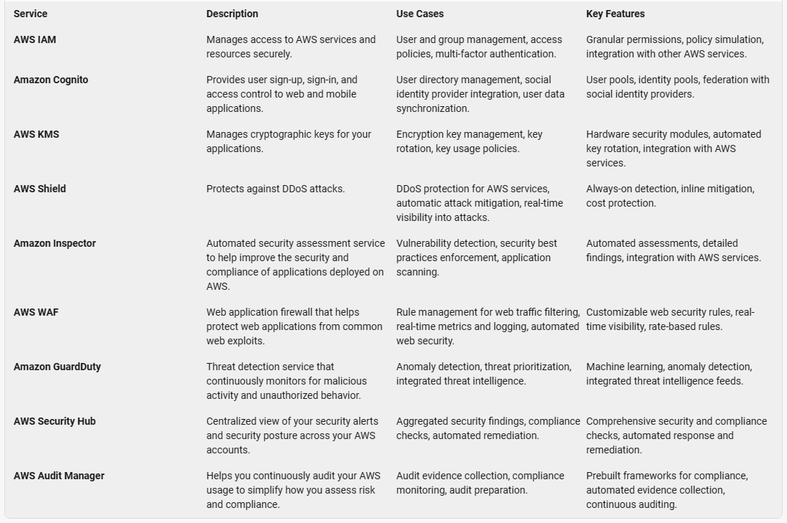

# AWS CloudFormation

**AWS CloudFormation** is a service that helps you model and set up your AWS resources, allowing you to focus more on your applications that run in AWS. You create a template that describes all the AWS resources you want, like Amazon EC2 instances or Amazon RDS DB instances, and CloudFormation takes care of provisioning and configuring those resources for you.

## Simplify Infrastructure Management

- A template describes all your resources and their properties.
- When you use that template to create a CloudFormation stack, CloudFormation provisions the Auto Scaling group, load balancer, and database for you.
- After the stack has been successfully created, your AWS resources are up and running.
- You can delete the stack just as easily, which deletes all the resources in the stack.
- By using CloudFormation, you easily manage a collection of resources as a single unit.

## Quickly Replicate Your Infrastructure

- Reuse your CloudFormation template to create your resources in a consistent and repeatable manner.
- Describe your resources once and then provision the same resources over and over in multiple regions.

## Easily Control and Track Changes to Your Infrastructure

- When you provision your infrastructure with CloudFormation, the template describes exactly what resources are provisioned and their settings.
- These templates are text files, so you can track differences in your templates to track changes to your infrastructure, similar to how developers control revisions to source code.
- You can use a version control system with your templates to know exactly what changes were made, who made them, and when.
- If you need to reverse changes to your infrastructure, you can use a previous version of your template.

## Template Anatomy

A template is a JSON- or YAML-formatted text file that describes your AWS infrastructure. The following examples show an AWS CloudFormation template structure and its sections.

### JSON

The following example shows a JSON-formatted template fragment.

```json
{
  "AWSTemplateFormatVersion" : "version date",
  "Description" : "JSON string",
  "Metadata" : {
    // template metadata
  },
  "Parameters" : {
    // set of parameters
  },
  "Rules" : {
    // set of rules
  },
  "Mappings" : {
    // set of mappings
  },
  "Conditions" : {
    // set of conditions
  },
  "Transform" : {
    // set of transforms
  },
  "Resources" : {
    // set of resources
  },
  "Outputs" : {
    // set of outputs
  }
}
```

### YAML-Formatted Template Fragment

```yaml
AWSTemplateFormatVersion: "version date"

Description:
  String

Metadata:
   template metadata

Parameters:
   set of parameters

Rules:
   set of rules

Mappings:
   set of mappings

Conditions:
   set of conditions

Transform:
   set of transforms

Resources:
   set of resources

Outputs:
   set of outputs

```

## Template Sections

Templates include several major sections. The **Resources** section is the only required section. Some sections in a template can be in any order. However, as you build your template, it can be helpful to use the logical order shown in the following list because values in one section might refer to values from a previous section.

### Format Version (optional)

The AWS CloudFormation template version that the template conforms to. The template format version isn't the same as the API or WSDL version. The template format version can change independently of the API and WSDL versions.

### AWS CloudFormation Template Content

#### JSON Format

```json
{
  "AWSTemplateFormatVersion": "2010-09-09",
  "Description": "Here are some details about the template.",
  "Metadata": {
    "Instances": {
      "Description": "Information about the instances"
    },
    "Databases": {
      "Description": "Information about the databases"
    }
  },
  "Parameters": {
    "InstanceTypeParameter": {
      "Type": "String",
      "Default": "t2.micro",
      "AllowedValues": ["t2.micro", "m1.small", "m1.large"],
      "Description": "Enter t2.micro, m1.small, or m1.large. Default is t2.micro."
    }
  },
  "Ec2Instance": {
    "Type": "AWS::EC2::Instance",
    "Properties": {
      "InstanceType": {
        "Ref": "InstanceTypeParameter"
      },
      "ImageId": "ami-0ff8a91507f77f867"
    }
  }
}
```

#### YAML Format

```yaml

AWSTemplateFormatVersion: "2010-09-09"
Description: >
  Here are some
  details about
  the template.
Metadata:
  Instances:
    Description: "Information about the instances"
  Databases: 
    Description: "Information about the databases"
Parameters:
  InstanceTypeParameter:
    Type: String
    Default: t2.micro
    AllowedValues:
      - t2.micro
      - m1.small
      - m1.large
    Description: Enter t2.micro, m1.small, or m1.large. Default is t2.micro.
Ec2Instance:
  Type: AWS::EC2::Instance
  Properties:
    InstanceType:
      Ref: InstanceTypeParameter
    ImageId: ami-0ff8a91507f77f867
```



```yaml

Rules:
  testInstanceType:
    RuleCondition: !Equals 
      - !Ref Environment
      - test
    Assertions:
      - Assert:
          'Fn::Contains':
            - - a1.medium
            - !Ref InstanceType
        AssertDescription: 'For a test environment, the instance type must be a1.medium'
  prodInstanceType:
    RuleCondition: !Equals 
      - !Ref Environment
      - prod
    Assertions:
      - Assert:
          'Fn::Contains':
            - - a1.large
            - !Ref InstanceType
        AssertDescription: 'For a production environment, the instance type must be a1.large'

```

### AWS Rule Functions

In the condition or assertions of a rule, you can use intrinsic functions, such as `Fn::Equals`, `Fn::Not`, and `Fn::RefAll`. The condition property determines if AWS CloudFormation applies the assertions. If the condition evaluates to true, CloudFormation evaluates the assertions to verify whether a parameter value is valid when a provisioned product is created or updated. If a parameter value isn't valid, CloudFormation doesn't create or update the stack. If the condition evaluates to false, CloudFormation doesn't check the parameter value and proceeds with the stack operation.

#### Functions

- `Fn::And`
- `Fn::Contains`
- `Fn::EachMemberEquals`
- `Fn::EachMemberIn`
- `Fn::Equals`
- `Fn::Not`
- `Fn::Or`
- `Fn::RefAll`
- `Fn::ValueOf`
- `Fn::ValueOfAll`
- Supported Functions
- Supported Attributes

### Mappings (optional)

A mapping of keys and associated values that you can use to specify conditional parameter values, similar to a lookup table. You can match a key to a corresponding value by using the `Fn::FindInMap` intrinsic function in the Resources and Outputs sections.

```json

{
  "AWSTemplateFormatVersion": "2010-09-09",
  "Mappings": {
    "RegionMap": {
      "us-east-1": {
        "HVM64": "ami-0ff8a91507f77f867",
        "HVMG2": "ami-0a584ac55a7631c0c"
      },
      "us-west-1": {
        "HVM64": "ami-0bdb828fd58c52235",
        "HVMG2": "ami-066ee5fd4a9ef77f1"
      },
      "eu-west-1": {
        "HVM64": "ami-047bb4163c506cd98",
        "HVMG2": "ami-0a7c483d527806435"
      },
      "ap-northeast-1": {
        "HVM64": "ami-06cd52961ce9f0d85",
        "HVMG2": "ami-053cdd503598e4a9d"
      },
      "ap-southeast-1": {
        "HVM64": "ami-08569b978cc4dfa10",
        "HVMG2": "ami-0be9df32ae9f92309"
      }
    }
  },
  "Resources": {
    "myEC2Instance": {
      "Type": "AWS::EC2::Instance",
      "Properties": {
        "ImageId": {
          "Fn::FindInMap": [
            "RegionMap",
            {
              "Ref": "AWS::Region"
            },
            "HVM64"
          ]
        },
        "InstanceType": "m1.small"
      }
    }
  }
}
```

### Conditions (optional)

**Conditions** control whether certain resources are created or whether certain resource properties are assigned a value during stack creation or update. For example, you could conditionally create a resource that depends on whether the stack is for a **production** or **test environment**.

```yaml

AWSTemplateFormatVersion: 2010-09-09
Parameters:
  EnvType:
    Description: Environment type.
    Default: test
    Type: String
    AllowedValues:
      - prod
      - test
    ConstraintDescription: must specify prod or test.
Conditions:
  CreateProdResources: !Equals 
    - !Ref EnvType
    - prod
Resources:
  EC2Instance:
    Type: 'AWS::EC2::Instance'
    Properties:
      ImageId: ami-0ff8a91507f77f867
  MountPoint:
    Type: 'AWS::EC2::VolumeAttachment'
    Condition: CreateProdResources
    Properties:
      InstanceId: !Ref EC2Instance
      VolumeId: !Ref NewVolume
      Device: /dev/sdh
  NewVolume:
    Type: 'AWS::EC2::Volume'
    Condition: CreateProdResources
    Properties:
      Size: 100
      AvailabilityZone: !GetAtt 
        - EC2Instance
        - AvailabilityZone

```

### Transform (optional)

For serverless applications (also referred to as Lambda-based applications), **Transform** specifies the version of the **AWS Serverless Application Model (AWS SAM)** to use. When you specify a transform, you can use AWS SAM syntax to declare resources in your template. The model defines the syntax that you can use and how it's processed.

You can also use `AWS::Include` transforms to work with template snippets that are stored separately from the main AWS CloudFormation template. You can store your snippet files in an Amazon S3 bucket and then reuse the functions across multiple templates.

### Resources (required)

Specifies the stack resources and their properties, such as an Amazon Elastic Compute Cloud instance or an Amazon Simple Storage Service bucket. You can refer to resources in the Resources and Outputs sections of the template.

```yaml
Resources:
  MyEC2Instance:
    Type: "AWS::EC2::Instance"
    Properties:
      ImageId: "ami-0ff8a91507f77f867"

```

### Outputs (optional)

Describes the values that are returned whenever you view your stack’s properties. For example, you can declare an output for an S3 bucket name and then call the aws cloudformation describe-stacks AWS CLI command to view the name.

```yaml

Outputs:
  BackupLoadBalancerDNSName:
    Description: The DNSName of the backup load balancer
    Value: !GetAtt BackupLoadBalancer.DNSName
    Condition: CreateProdResources
  InstanceID:
    Description: The Instance ID
    Value: !Ref EC2Instance

```
