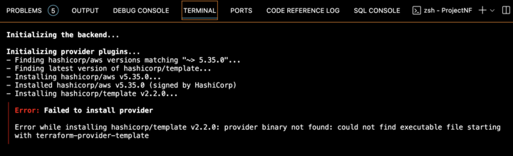
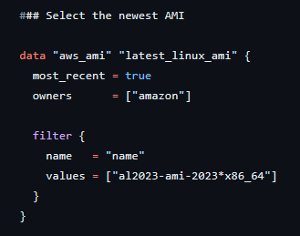
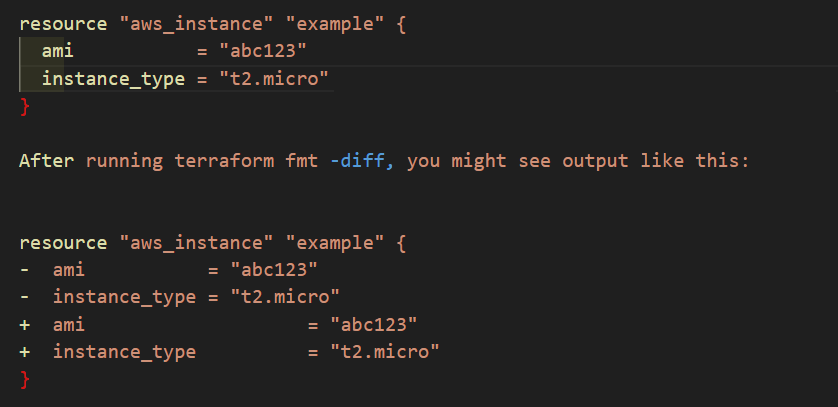

# Knowledge Base

## Terraform and AMI Issue

**Problem:**
Encountered issues while running the `terraform init` command in the local machine's terminal.



**Solution:**

There were issues fetching latest AMI Id due to Indentation issues in the terraform configuration file. Fixing this issue helped fetching right AMI id, consequently EC2 launch worked fine. Please note that this is not an issue with the terraform installation issue.

### Select the newest AMI



**Terraform `fmt`** is used to standardize the format and style of your Terraform configuration files.

When you run `terraform fmt`, it rewrites your Terraform configuration files to a canonical format and style. It applies a subset of the Terraform language style conventions, along with other minor adjustments for readability. The formatting decisions are intentionally opinionated and have no customization options because the goal is to encourage consistency.

Consistent formatting makes it easier for developers to collaborate and maintain code. Other Terraform commands that generate configuration files will produce files that conform to the style imposed by `terraform fmt`. Adopting this style in your own files ensures consistency.

**Usage:**
You can use `terraform fmt` with the following options:

- `-list=false`: Don't list files containing formatting inconsistencies.
- `-write=false`: Don't overwrite input files (implied by `-check` or when input is STDIN).
- `-diff`: Display diffs of formatting changes.
- `-check`: Check if the input is formatted. Exit status will be 0 if all input is properly formatted.

By default, it scans the current directory for configuration files. You can specify a target directory or file.

**Example of `terraform fmt -diff` Output:**

The `terraform fmt` command is used to rewrite Terraform configuration files to a canonical format and style. When you use the `-diff` option with this command, it displays the differences between the original and formatted code.

Here's an example of how you might use the `terraform fmt` command with the `-diff` option:

`terraform fmt -diff`

This command will show you a side-by-side comparison of the original code and the formatted code, highlighting the changes made by the formatter.

For instance, if you had a configuration file with the following content:



The - indicates lines that will be removed, and the + indicates lines that will be added, showing you exactly how the indentation and alignment will change to match the canonical format.

## Issue 2 : Amazon VPC Peering Network Connectivity Issues

[](https://www.youtube.com/watch?v=DLB2yNDyFmM)

## Can you disable S3 bucket versioning?

**Background**:

S3 bucket versioning is a feature in Amazon S3 that allows you to keep multiple versions of an object in the same bucket. Here's how it works:

- **Multiple Variants**: You can preserve, retrieve, and restore every version of every object stored in your buckets.
- **Recovery**: It helps in recovering from accidental deletions or overwrites. If an object is deleted, a delete marker is inserted, making it possible to restore the previous version.
- **Unique Version IDs**: Each version of an object is given a unique version ID. Even if you have two objects with the same key, they can be distinguished by their version IDs.
- **Charges Apply**: You are charged for each version of an object stored, as each version is considered a complete object.

By default, buckets are unversioned, and you must explicitly enable this feature. Once enabled, it cannot be reverted to an unversioned state, but you can suspend versioning.

- **Versioning Suspension**: Versioning cannot be turned off, it can only be suspended. To deactivate the versioning process, you would use `Status=Suspended`.

- **Lifecycle Independence**: The Lifecycle operation is independent of the bucket's Versioning status. If your lifecycle policy is configured to delete previous versions after 90 days, leave it as is. It will continue to expire old versions for the next 90 days. After that, if there are no new versions of objects to expire, you could then delete the Lifecycle rule.

- **Immediate Deletion**: If you wish to immediately delete all non-current versions of objects, you could modify the Lifecycle rule and set `NoncurrentDays` to 1, which should make the versions expire (delete) quicker. It's uncertain if setting it to zero would have the intended effect.

For more detailed information, you can refer to the official AWS documentation on [Using versioning in S3 buckets] and [How S3 Versioning works].

## MFA Delete in the context of Amazon S3

MFA Delete in the context of Amazon S3 is a feature that adds an additional layer of security by requiring multi-factor authentication (MFA) for the permanent deletion of objects or for changing the versioning state of an S3 bucket. When MFA Delete is enabled, the bucket owner must provide two forms of authentication:

1. **AWS Security Credentials**: The standard credentials used to authenticate with AWS services.
2. **MFA Code**: A valid six-digit code displayed on an approved MFA device, along with the device's serial number.

This requirement ensures that even if someone has access to your AWS security credentials, they cannot permanently delete an object version or alter the versioning state of the bucket without also having physical access to the MFA device.

Here's a summary of what MFA Delete entails:

- **Enhanced Security**: Protects against accidental or malicious deletions.
- **Root Account Only**: Only the AWS account that created the bucket (root account) can enable or disable MFA Delete.
- **Versioning Required**: The bucket must have versioning enabled to use MFA Delete.
- **CLI or API**: MFA Delete can only be enabled or disabled using the AWS Command Line Interface (CLI) or API, not through the AWS Management Console.

For more detailed information, you can refer to the official AWS documentation on [Configuring MFA delete].

## How to apply MFA delete on an S3 bucket?

Sure, here's the markdown code for the steps to apply MFA delete on an S3 bucket:

To apply MFA (Multi-Factor Authentication) delete on an S3 bucket, you need to perform the following steps:

1. **Use the Root Account**: Log in to the AWS Management Console with the root account credentials.

2. **Enable Versioning**: Ensure that versioning is enabled on your S3 bucket.

3. **Set Up CLI**: Configure the AWS Command Line Interface (CLI) using the root account credentials.

4. **Activate MFA Device**: Activate a virtual or hardware MFA device for the root user.

5. **Enable MFA Delete**: Use the AWS CLI to enable MFA delete. This cannot be done through the AWS Management Console. The command will look something like this:

   ```shell
   aws s3api put-bucket-versioning --bucket BUCKET-NAME --versioning-configuration Status=Enabled,MFADelete=Enabled --mfa "SERIAL_NUMBER MFA_CODE"
   ```

   Replace `BUCKET-NAME` with the name of your bucket, `SERIAL_NUMBER` with the serial number of your MFA device, and `MFA_CODE` with the code from your MFA device.

6. **Verify**: Check the versioning status of your bucket to confirm that MFA delete is enabled.

7. **Test MFA Delete**: Optionally, test the MFA delete feature by trying to delete an object version with the required MFA.

Remember, only the root account can enable or disable MFA delete, and it adds an additional layer of security by requiring the MFA code for deleting an object version or changing the versioning state of the bucket.
